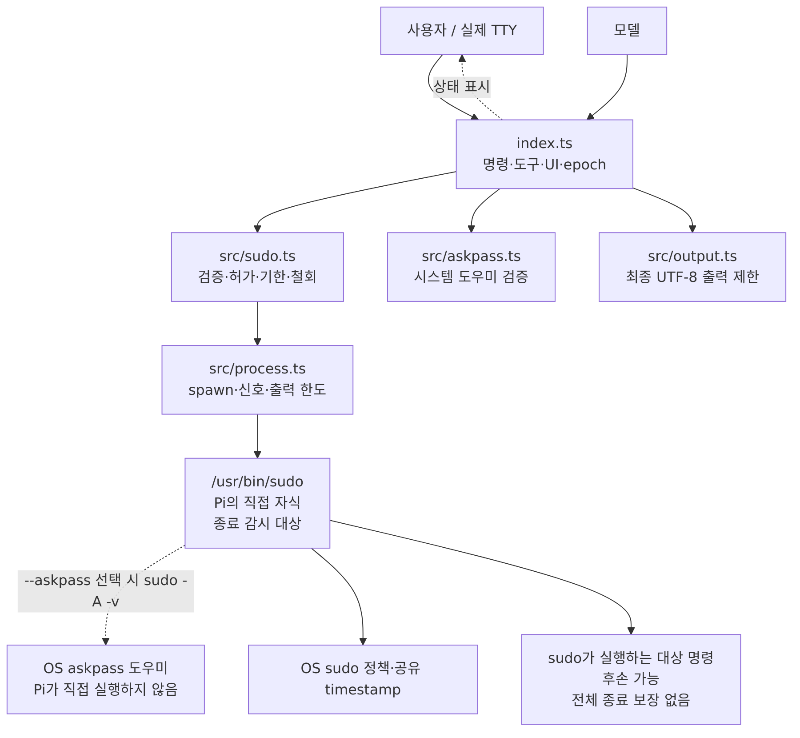
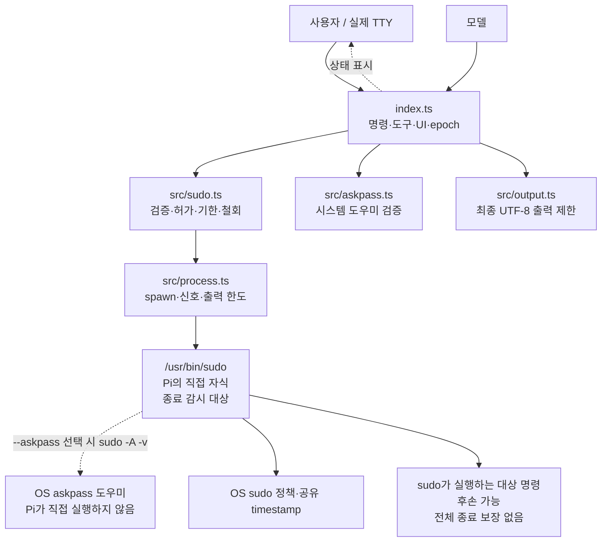
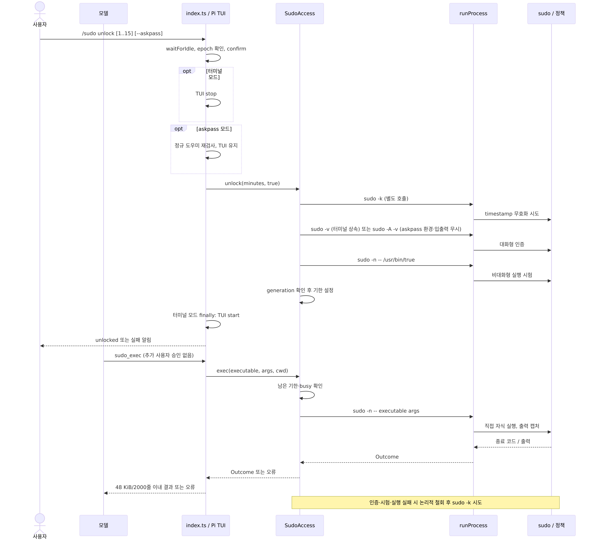
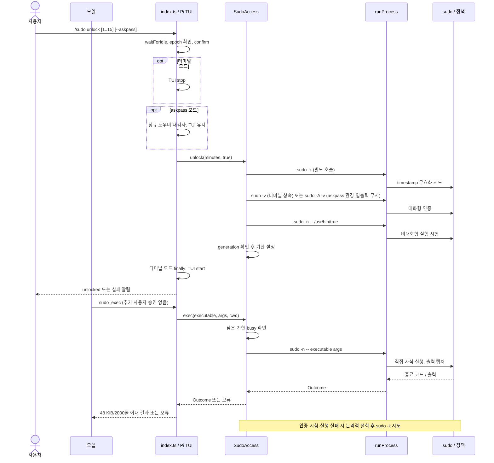
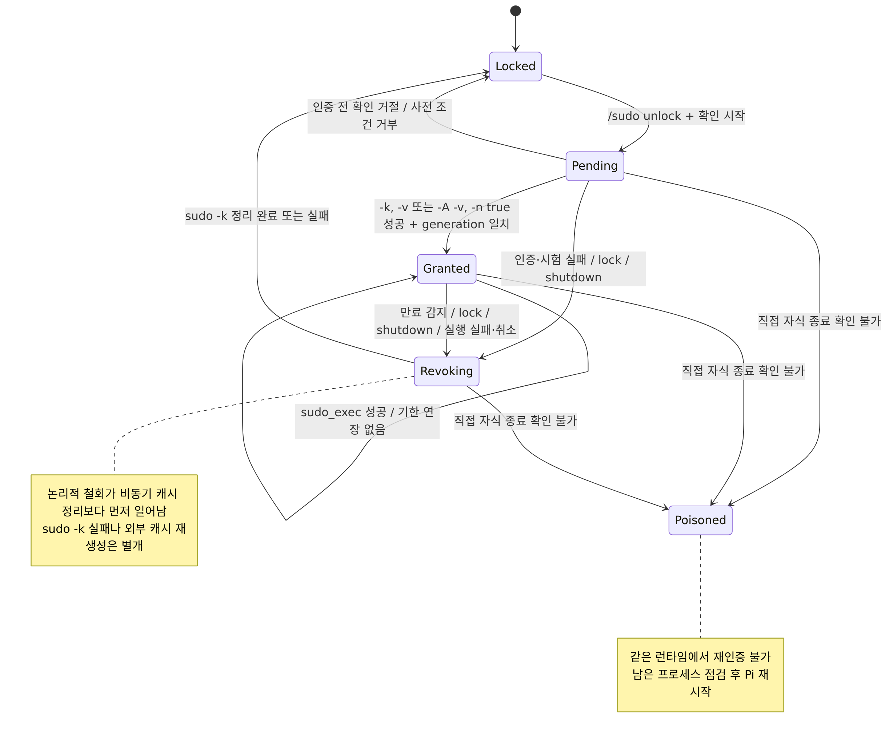
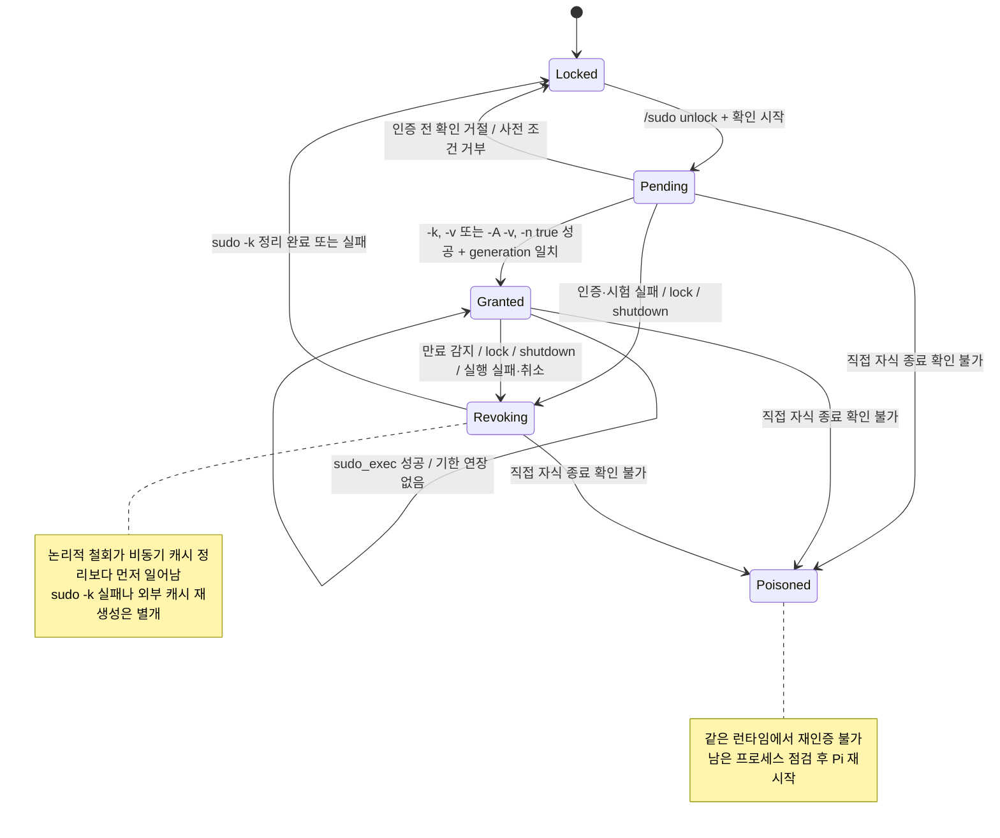

# 구조와 설계 근거

이 문서는 **현재 구현**의 책임과 접근 상태 경계를 설명합니다. 사용 입력 형식은 [사용 방법](usage.md), 캐시·프로세스 위험은 [보안 경계](security.md)에 둡니다.

그림의 정본은 [`modules.mmd`](diagram/modules.mmd)입니다. PNG·SVG는 `bun run docs:render`로 생성합니다. 아래 이미지 링크와 접힌 Mermaid 블록도 자동으로 동기화하므로 직접 수정하지 않습니다.

<!-- diagram:modules:start -->

[Mermaid 원본](diagram/modules.mmd) · [SVG](diagram/modules.svg)

Mermaid 코드 보기

<!-- diagram:modules:end -->

| 파일 | 책임 | 책임이 아닌 것 |
| --- | --- | --- |
| `index.ts` | Pi `/sudo` 명령, `sudo_exec` 도구 및 `session_shutdown` 등록; TUI 확인·중지/복원, host/TTY 확인, status 표시 | sudo credential 보관, OS 캐시 격리 |
| `src/askpass.ts` | 실경로 도우미와 상위 디렉터리 신뢰 검사 | GUI 실행·sudo 정책 |
| `src/output.ts` | UTF-8 최종 모델 출력 제한 | 인증 출력 저장 |
| `src/sudo.ts` | 입력 유효성 검사, 인증/시험/실행/철회 상태, 기한·동시성·실패 폐쇄 | TUI 소유, 자식 프로세스 생성 세부 사항 |
| `src/process.ts` | `/usr/bin/sudo` 파일 검사, `spawn`·타임아웃·신호·제한된 출력 수집 | sudo 정책 결정, 후손 종료 보장 |
| `test/extension.test.ts` | Pi 진입점 등록과 TUI·shutdown·tool 경계 | 실제 터미널 인증 |
| `test/sudo.test.ts` | 가짜 clock/runner로 인증 순서·기한·경합·poison 검증 | OS sudo cache 실제 동작 |
| `test/process.test.ts` | 비특권 subprocess의 출력·종료·pipe 감시 | privileged 자식 종료 보장 |

루트 `index.ts`를 유지하는 이유는 `package.json`의 `pi.extensions`가 `./index.ts`를 참조하기 때문입니다. Pi UI 관심사와 sudo 허가 상태, OS 프로세스 수명주기를 분리해 각각의 테스트 경계를 명확히 합니다.

## 인증과 실행

정상 인증과 실행 경로입니다. 인증 시작 뒤 실패한 경로는 접근 철회와 캐시 무효화 시도로 끝납니다. 정본: [`auth-exec.mmd`](diagram/auth-exec.mmd).

<!-- diagram:auth-exec:start -->

[Mermaid 원본](diagram/auth-exec.mmd) · [SVG](diagram/auth-exec.svg)

Mermaid 코드 보기

<!-- diagram:auth-exec:end -->

`index.ts`의 `authorizationEpoch`는 대기 중인 `waitForIdle`/확인이 잠금 또는 종료 뒤 늦게 성공하는 일을 막습니다. `pendingUnlock`은 확인 UI 중복을 차단합니다. `touched`는 sudo 경로에 진입했는지 기록해 도구의 최초 사용과 shutdown 정리를 게이트할 뿐, **접근 허가 상태가 아닙니다**. 실제 허가는 `SudoAccess`의 기한 확인으로 판정합니다. `src/sudo.ts`의 `generation`은 비동기 인증 완료가 이미 철회된 접근을 다시 여는 일을 막고, `active`/`locking`은 실행과 잠금 작업이 경합하지 않게 합니다.

기본 인증에는 실제 터미널을 상속시키고 askpass 선택 시에만 sudo 인증 자식에게 도우미 환경 변수를 전달하고 표준 입출력을 무시합니다. 도우미 검사는 확인 전과 인증 직전에 수행합니다. `src/output.ts`는 도구 결과의 헤더·정리 경고까지 포함해 UTF-8 크기와 줄 수를 제한합니다., 실행·시험·무효화에는 출력 크기가 제한된 파이프(표준 입력은 무시)를 사용합니다. 모두 같은 Pi 프로세스를 부모로 하는 non-detached 직접 자식이므로 같은 sudo timestamp 범위를 사용하는 구성을 시험할 수 있지만, sudoers 정책이나 OS 캐시 구성을 강제하지는 않습니다.

## 허가 수명

아래 상태명은 구현의 필드를 설명하기 위한 개념적 구분이며 코드에 별도 enum으로 선언된 상태가 아닙니다. 정본: [`grant-lifecycle.mmd`](diagram/grant-lifecycle.mmd).

<!-- diagram:grant-lifecycle:start -->

[Mermaid 원본](diagram/grant-lifecycle.mmd) · [SVG](diagram/grant-lifecycle.svg)

Mermaid 코드 보기

<!-- diagram:grant-lifecycle:end -->

논리적 접근 철회(`clear`)는 비동기 `sudo -k` 완료보다 먼저 일어납니다. 실패·만료 뒤 새 도구 실행을 즉시 거부하기 위한 순서입니다. 단조 시간은 시계 후퇴로 인한 연장을 막고 벽시계 시간은 절전 뒤 다음 검사에서 만료를 감지합니다. 직접 자식의 `exit`와 파이프의 `close`는 별개 이벤트이며, 종료가 확인되지 않으면 `terminationUnconfirmed`로 해당 런타임을 poison 처리해 다시 열지 않습니다. 일반 잠금 뒤 새로 열려면 사용자에게 다시 확인과 인증을 요구하며 자동 연장은 없습니다. Poisoned 상태는 같은 런타임에서 재인증할 수 없고, 남은 프로세스를 확인한 뒤 Pi를 재시작해야 합니다.
